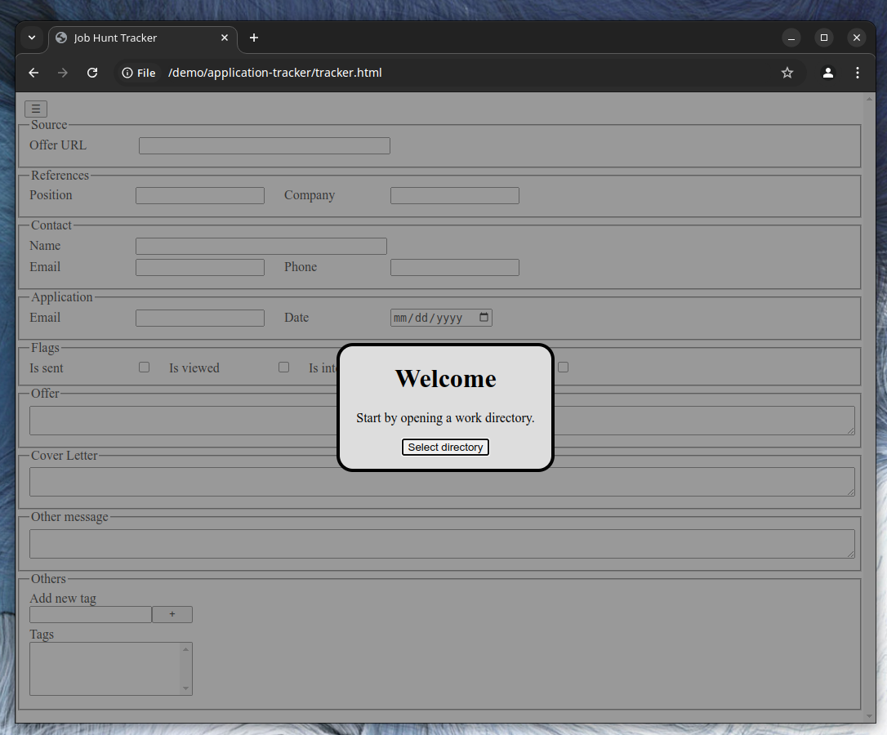
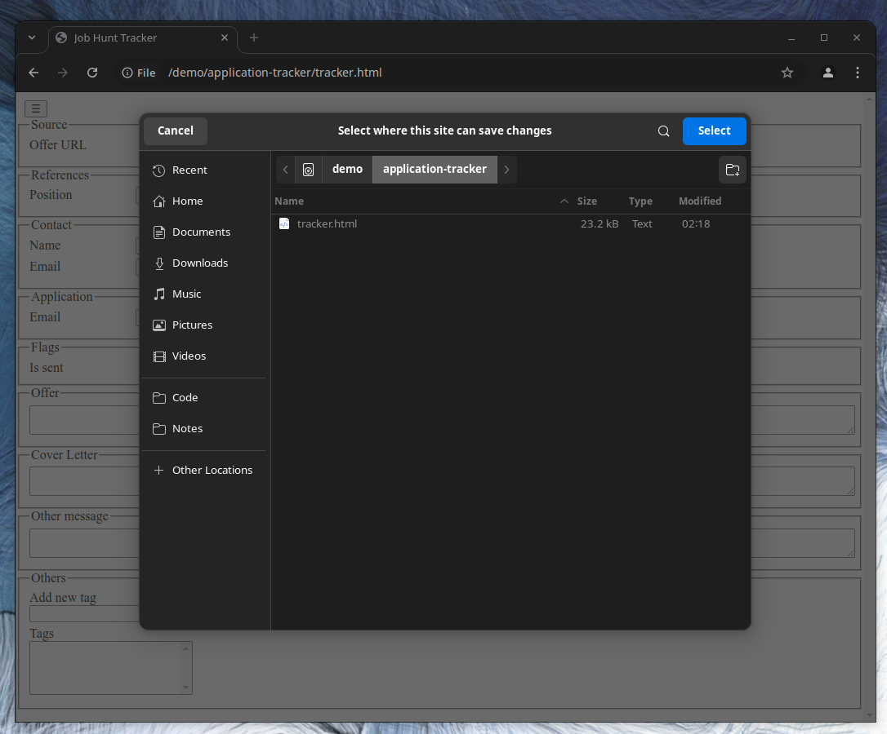
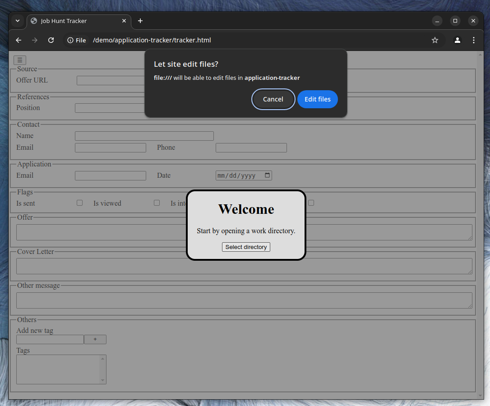
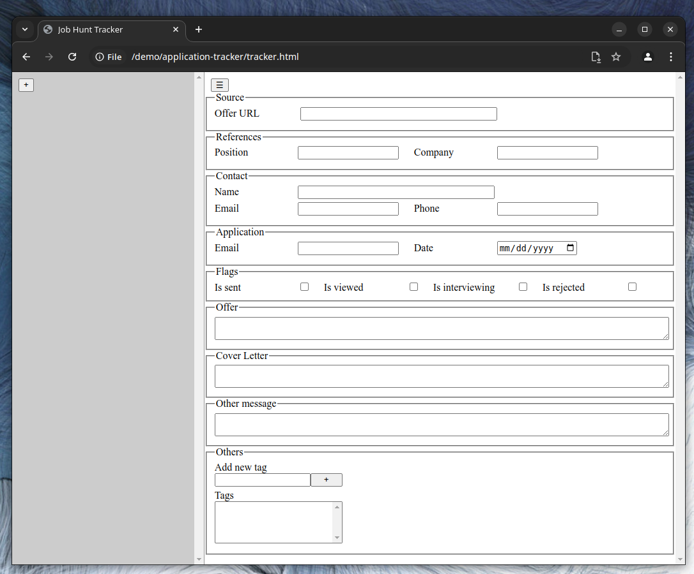
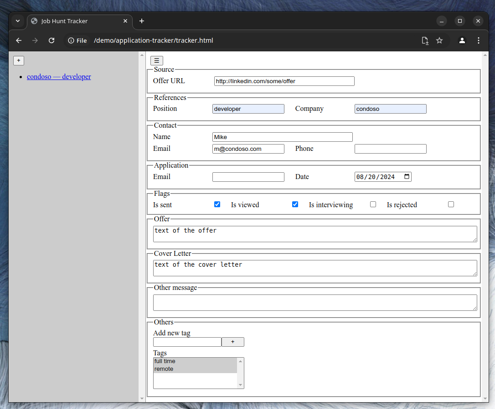
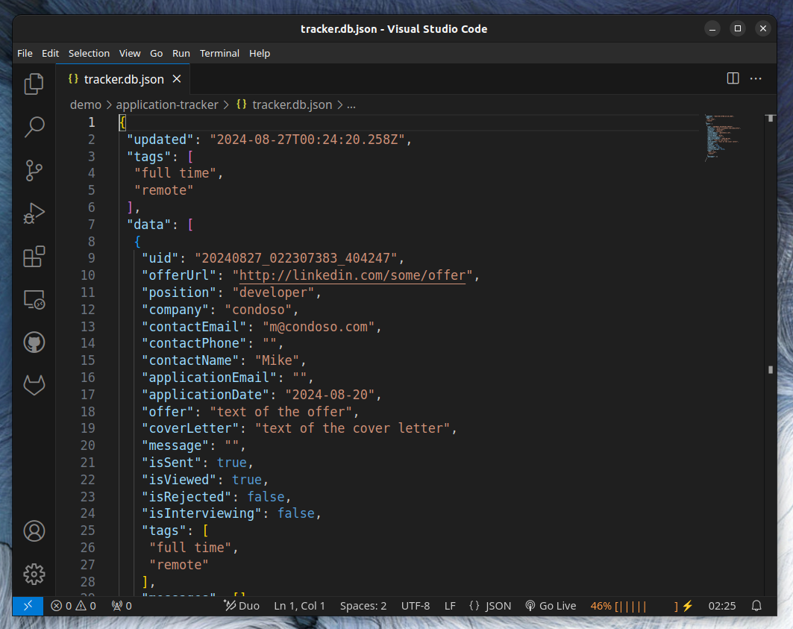

# Job Application Tracker

Basic tool to track Job Applications

Chrome or Chromium required.

## How to

1. Open the `tracker.html` page.

2. Select the work directory.

3. Accept to "Edit files".

4. If you open an empty directory, you will need to create a new application with the [+] button of the left menu.

5. When you have entries, you can click a link in the left menu to open them in the right content view.

6. Changes are saved immediately to file. The database is a human readable JSON file.

